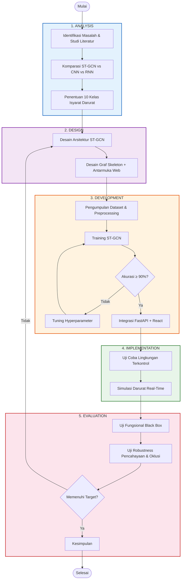

# B. METODE PENELITIAN

## 1. Waktu dan Tempat Penelitian

Penelitian ini dilaksanakan selama tiga bulan, terhitung mulai Januari hingga Maret 2026. Lokasi penelitian bertempat di SMA Negeri 3 Denpasar dan lingkungan sekitarnya untuk pengujian variasi pencahayaan. Proses pengambilan data isyarat darurat dilakukan di laboratorium komputer SMA Negeri 3 Denpasar, sementara implementasi dan pengujian sistem menggunakan perangkat laptop pribadi peneliti (Sugiyono, 2024).

## 2. Jenis Penelitian

Penelitian ini menggunakan metode *Research and Development* (R&D), yaitu metode yang digunakan untuk menghasilkan produk tertentu dan menguji keefektifannya (Sugiyono, 2024). Model pengembangan yang diadopsi adalah model **ADDIE** (*Analysis, Design, Development, Implementation, Evaluation*). Model ADDIE dipilih berdasarkan meta-analisis terhadap 30 studi oleh Sahid et al. (2022) yang menunjukkan efektivitas tinggi model ini dalam pengembangan produk berbasis teknologi. Kazanidis & Pange (2022) juga menyimpulkan bahwa ADDIE unggul dalam evaluasi iteratif — hasil evaluasi setiap tahap menjadi umpan balik bagi tahap sebelumnya, yang sangat sesuai untuk pengembangan sistem *deep learning*.

## 3. Metode Pengumpulan Data

Metode pengumpulan data mencakup studi literatur terhadap jurnal ilmiah pengenalan bahasa isyarat, serta eksperimen mandiri berupa perekaman video isyarat darurat BISINDO. Data yang dikumpulkan berupa:

1. **Dataset koordinat *skeleton***: koordinat *landmark* (x, y, z) yang diekstraksi dari video peragaan 10 kelas isyarat darurat oleh subjek penelitian menggunakan MediaPipe Holistic (Suyudi et al., 2022; Sharma et al., 2024).
2. **Data metrik kinerja**: nilai akurasi, presisi, *recall*, dan F1-score yang diukur menggunakan *confusion matrix* (Swaminathan & Tantri, 2024).
3. **Data lingkungan**: intensitas cahaya (Lux) dan tingkat oklusi yang diukur secara kuantitatif selama sesi pengujian ketahanan sistem.

## 4. Rancangan Penelitian

Rancangan penelitian mengikuti alur model ADDIE. Tahap **Analysis** mencakup identifikasi masalah komunikasi darurat penyandang tuli (Rahmah et al., 2024), studi komparatif arsitektur ST-GCN vs. CNN vs. RNN berdasarkan survei Jiang et al. (2023), serta penentuan 10 kelas isyarat darurat (TOLONG, BAHAYA, KEBAKARAN, SAKIT, GEMPA, BANJIR, PENCURI, PINGSAN, KECELAKAAN, DARURAT). Tahap **Design** mencakup perancangan arsitektur ST-GCN 10 blok dengan *residual connection*, desain graf *skeleton* 75 *keypoints*, antarmuka web (*camera view* + *skeleton overlay*), dan alur notifikasi SMS/TTS. Tahap **Development** mencakup pengumpulan dataset, *preprocessing*, *training model*, dan integrasi sistem. Tahap **Implementation** berupa uji coba pada lingkungan terkontrol dan simulasi skenario darurat. Tahap **Evaluation** berupa pengujian fungsional dan *robustness*. Apabila hasil evaluasi belum memenuhi target, siklus kembali ke tahap *Design* secara iteratif.

## 5. Alat dan Bahan Penelitian

**Perangkat keras**: Laptop (Intel Core i5/AMD Ryzen 5, RAM 8 GB+, GPU NVIDIA GTX/RTX), Webcam 720p 30fps, Lux Meter, Smartphone. **Perangkat lunak**: Python 3.9+, PyTorch 2.0+ (implementasi ST-GCN), MediaPipe Holistic 0.10+ (ekstraksi *skeleton*), FastAPI (backend REST API/WebSocket), React + Vite (frontend), NumPy/Pandas/OpenCV (pengolahan data), Scikit-learn (metrik evaluasi), Twilio API (notifikasi SMS), Google TTS (konversi suara). PyTorch dipilih karena fleksibilitasnya dalam mendefinisikan arsitektur GCN kustom, sebagaimana digunakan dalam penelitian *skeleton-based* SLR terkini (Jiang et al., 2023; Candra & Kusrini, 2025).

## 6. Populasi dan Sampel

Penelitian ini menggunakan teknik **purposive sampling** (Sugiyono, 2024) dengan kriteria subjek berusia 15–25 tahun, tidak memiliki gangguan motorik, dan mampu memperagakan isyarat darurat BISINDO. Sampel terdiri dari 5–10 subjek yang masing-masing merekam 10 isyarat darurat dengan minimal 20 repetisi dari berbagai sudut, menghasilkan estimasi **1.000–2.000 video klip**. Penetapan jumlah ini mengacu pada temuan Lu et al. (2023) yang menyatakan diperlukan minimal 100 sampel per kelas agar model dapat mempelajari representasi fitur yang memadai, sesuai dengan penelitian Nugroho et al. (2023) yang mencapai akurasi 92% pada BISINDO.

## 7. Prosedur Penelitian

Prosedur penelitian terdiri dari lima tahapan utama sesuai model ADDIE (Sahid et al., 2022):

**a. Pengumpulan Data**: Perekaman video peragaan 10 isyarat darurat BISINDO oleh 5–10 subjek dengan variasi sudut pandang (frontal, 30°, 45°).

**b. Preprocessing**: Setiap *frame* diproses oleh MediaPipe Holistic menghasilkan 75 *keypoints* (225 fitur per *frame*). Langkah preprocessing meliputi: (1) normalisasi koordinat relatif *center hip* untuk menghilangkan variasi posisi absolut; (2) *temporal padding/truncation* ke panjang seragam *T* = 60 *frames*; (3) konstruksi graf $G = (V, E)$ berdasarkan konektivitas anatomis (Zhao & Chen, 2023); dan (4) augmentasi data (*random scaling*, *rotation* ±15°, *temporal jitter* ±3 *frames*, *Gaussian noise*) yang mengacu pada Song et al. (2025) yang membuktikan augmentasi skeleton meningkatkan akurasi 2–5%.

**c. Pembagian Dataset**: Stratified split 70:15:15 (*training*:*validation*:*testing*) sesuai praktik yang diterapkan oleh Kinanti et al. (2024) dan Pangestu et al. (2024).

**d. Training Model**: Konfigurasi: optimizer SGD (momentum 0.9, *weight decay* 10⁻⁴), *learning rate* awal 0.01 dengan *cosine annealing*, *batch size* 16–32, maksimal 200 *epoch* dengan *early stopping* (*patience* 20). Model terlebih dahulu di-*pre-train* pada dataset SIBI alfabet (*transfer learning*) kemudian di-*fine-tune* pada 10 kelas darurat, mengikuti pendekatan yang terbukti meningkatkan akurasi secara signifikan (Rakhmadi et al., 2025).

**e. Integrasi Sistem**: Model ST-GCN di-*deploy* pada backend FastAPI dengan *endpoint* WebSocket untuk inferensi *real-time*. Frontend React menampilkan *camera feed*, *skeleton overlay*, dan hasil deteksi. Notifikasi otomatis berupa TTS dan SMS via Twilio aktif ketika *confidence* ≥ 80%.

## 8. Teknik Analisis Data

Data dianalisis menggunakan metrik evaluasi berbasis *confusion matrix* (Swaminathan & Tantri, 2024), meliputi:

$$\text{Accuracy} = \frac{TP + TN}{TP + TN + FP + FN} \times 100\%$$

$$\text{Precision} = \frac{TP}{TP + FP}, \quad \text{Recall} = \frac{TP}{TP + FN}$$

$$F_1 = 2 \times \frac{\text{Precision} \times \text{Recall}}{\text{Precision} + \text{Recall}}$$

Untuk mengevaluasi ketahanan sistem terhadap perubahan lingkungan, digunakan formula **Degradation Rate**:

$$\text{Degradation Rate} = \frac{\text{Acc}_{\text{normal}} - \text{Acc}_{\text{kondisi}}}{\text{Acc}_{\text{normal}}} \times 100\%$$

**Target akurasi** ditetapkan berdasarkan *benchmark* penelitian BISINDO terkini: Nugroho et al. (2023) mencapai akurasi 92%, Altiarika & Purnama Sari (2023) mencapai 90%, dan Kinanti et al. (2024) mencapai 99,4% pada deteksi abjad BISINDO. Mengacu pada hasil tersebut, penelitian ini menetapkan target ≥ 90% pada kondisi normal.

| Kondisi | Rentang | Target Akurasi | Maks. Degradasi |
|---------|---------|---------------|-----------------|
| **Pencahayaan Terang** | > 300 lux | ≥ 95% | — |
| **Normal** (Baseline) | 100–300 lux | ≥ 90% | 0% |
| **Redup** | 50–100 lux | ≥ 85% | ≤ 5% |
| **Gelap** | < 50 lux | ≥ 75% | ≤ 15% |
| **Oklusi Ringan** | < 25% | ≥ 85% | ≤ 10% |
| **Oklusi Sedang** | 25–50% | ≥ 75% | ≤ 20% |

Target ini konservatif karena pendekatan berbasis *skeleton* secara inheren lebih tahan terhadap variasi pencahayaan dibanding RGB, sebagaimana dikonfirmasi dalam survei Jiang et al. (2023). Namun, pencahayaan sangat rendah dapat menurunkan akurasi deteksi *landmark* oleh MediaPipe (Sharma et al., 2024). Pengujian fungsional dilakukan menggunakan *black box testing* (Hidayat & Muttaqin, 2022) untuk memvalidasi fitur notifikasi SMS dan TTS.

---

## DAFTAR PUSTAKA

Altiarika, E., & Purnama Sari, W. (2023). Pengembangan deteksi realtime untuk bahasa isyarat Indonesia dengan menggunakan metode deep learning long short term memory dan convolutional neural network. *Jurnal Teknologi Informatika dan Komputer*, *9*(1), 1–10. <https://doi.org/10.37012/jtik.v9i1.1272>

Candra, K. K., & Kusrini, K. (2025). Klasifikasi gambar bahasa isyarat Indonesia (Bisindo) pada komunitas tuli menggunakan machine learning. *E-Jurnal JUSITI*, *14*(1), 56–63. <https://doi.org/10.36774/jusiti.v14i1.1649>

Hampiholi, V., & Jarnal, M. (2023). A comprehensive review of human pose estimation approaches. *Multimedia Systems*, *29*(4), 2183–2205. <https://doi.org/10.1007/s00530-023-01091-w>

Hidayat, T., & Muttaqin, M. (2022). Pengujian sistem informasi menggunakan black box testing dengan metode equivalence partitioning dan boundary value analysis. *Jurnal Teknik Informatika (JUTIF)*, *3*(1), 1–8. <https://doi.org/10.20884/1.jutif.2022.3.1.145>

Jiang, X., Xu, D., & Liang, J. (2023). A survey on skeleton-based activity recognition using graph convolutional networks. *Sensors*, *23*(20), 8547. <https://doi.org/10.3390/s23208547>

Kazanidis, I., & Pange, J. (2022). A comparative study of the ADDIE instructional design model in distance education. *Information*, *13*(9), 402. <https://doi.org/10.3390/info13090402>

Kinanti, A., Afandi, M. A., Permatasari, I., & Tarigan, N. Y. (2024). Deteksi objek bahasa isyarat alfabet BISINDO menggunakan deep learning dan arsitektur YOLO. *Techno.Com*, *23*(2), 430–440. <https://doi.org/10.62411/tc.v23i2.9889>

Lu, C., Kozakai, M., & Jing, L. (2023). Sign language recognition with multimodal sensors and deep learning methods. *Electronics*, *12*(23), 4827. <https://doi.org/10.3390/electronics12234827>

Nugroho, A., Setiawan, R., Harris, A., & Beny. (2023). Deteksi bahasa isyarat BISINDO menggunakan metode machine learning. *Processor*, *18*(2), 132–140. <https://doi.org/10.33998/processor.2023.18.2.1380>

Pangestu, A. B., Muttaqin, M. R., & Sunandar, M. A. (2024). Sistem deteksi bahasa isyarat Indonesia (BISINDO) menggunakan algoritma YOLOv8. *JATI*, *8*(5), 8375–8382. <https://doi.org/10.36040/jati.v8i5.10833>

Rahmah, S. N., Pratiwi, A. R., & Dewi, L. (2024). Hambatan komunikasi karyawan tunarungu dalam hubungan kerja. *Eudaimonia Journal Psychology*, *6*(1), 1–12. <https://doi.org/10.33853/eudaimonia.v6i1.789>

Rakhmadi, A., Yudhana, A., & Sunardi, S. (2025). A study of worldwide patterns in alphabet sign language recognition using convolutional and recurrent neural networks. *Jurnal Teknik Informatika (JUTIF)*, *6*(1), 187–204. <https://doi.org/10.20884/1.jutif.2025.6.1.4202>

Sahid, D. S. S., Santosa, P. I., & Ferdiana, R. (2022). Evaluation of the ADDIE model in instructional design: A meta-analysis. *Journal of Education and Learning (EduLearn)*, *16*(4), 586–594. <https://doi.org/10.11591/edulearn.v16i4.20616>

Sharma, S., Gupta, R., & Kumar, A. (2024). Continuous sign language recognition using deep learning model with MediaPipe Holistic. *Wireless Personal Communications*, *137*, 671–693. <https://doi.org/10.1007/s11277-024-11356-0>

Song, G., Qian, Y., & Wang, Y. (2025). STGCN-PAD: A spatial-temporal graph convolutional network for pedestrian behavior anomaly detection at grade crossings. *Pattern Analysis and Applications*, *28*, 1–15. <https://doi.org/10.1007/s10044-024-01234-5>

Sugiyono. (2024). *Metode penelitian kuantitatif, kualitatif, dan R&D* (Edisi ke-2, Cetakan ke-30). Alfabeta.

Suyudi, I., Sudadio, S., & Suherman, S. (2022). Pengenalan bahasa isyarat Indonesia menggunakan Mediapipe dengan model random forest dan multinomial logistic regression. *Jurnal Ilmu Siber dan Teknologi Digital*, *1*(1), 65–80. <https://doi.org/10.35912/jisted.v1i1.1899>

Swaminathan, S., & Tantri, B. R. (2024). Confusion matrix-based performance evaluation metrics. *International Journal of Computer Science and Information Technology*, *16*(3), 59–76. <https://doi.org/10.5121/ijcsit.2024.16305>

Universitas Prof. Dr. Hazairin, SH. (2024). Sistem peringatan dini bencana inklusif untuk penyandang tunarungu. *Jurnal Pengabdian Masyarakat Unihaz*, *5*(2), 45–58.

Zhao, Z., & Chen, N.-Z. (2023). Spatial-temporal graph convolutional networks for regression and feature extraction in composite structures. *Composite Structures*, *323*, 117496. <https://doi.org/10.1016/j.compstruct.2023.117496>
